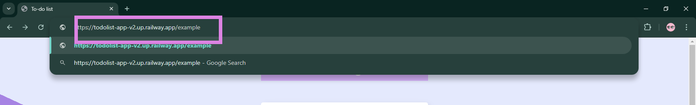
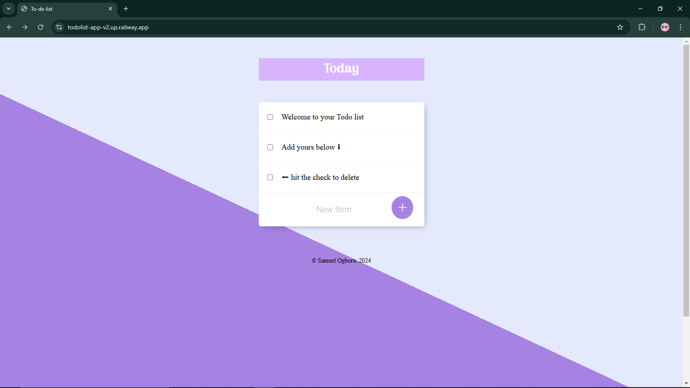

## Table of Contents

- [Overview](#overview)
  - [Screenshot](#screenshot)
  - [Links](#links)
- [My Process](#my-process)
  - [Built With](#built-with)
  - [What I Learned](#what-i-learned)
  - [Continued Development](#continued-development)
  - [Useful Resources](#useful-resources)
- [Author](#author)
- [Acknowledgments](#acknowledgments)

## Overview

Users should be able to:

- Add new list item to the list
- Delete existing items in the list
- Create a new list by add the name of the list in the url example below 

### Screenshot

### Links

- Live Site URL: [Live Page](https://todolist-app-v2.up.railway.app/)

## My Process

### Built With

- CSS custom properties
- TailwindCSS
- Desktop-first workflow
- JavaScript
- EJS
- NodeJS/ExpressJS
- MongoDB/Mongoose

### What I Learned

- How to create a multi-page website using nodeJS/ExpressJS
- How to handle user interactions and update the UI accordingly
- How to connect, GET, PUT and POST requests to a remote and local database using mongoDB/mongoose
- How to make use of mongoDB shell alias Mongosh

### Continued Development

- Explore more advanced CSS techniques, such as animations and transitions
- Learn more about JavaScript libraries and frameworks, such as React
- Improve my debugging skills by using browser developer tools and debugging techniques

### Useful Resources

- [TailwindCSS](https://tailwindcss.com/docs/installation) - TailwindCSS docs trust me it's easier than you thought
- [Debugging JavaScript](https://developer.mozilla.org/en-US/docs/Mozilla/Debugging/Debugging_JavaScript) - Mozilla Developer Network documentation on debugging JavaScript

## Author

- Website - [Samuel Ogboru](https://portfolio-nine-gules-60.vercel.app/)
- Twitter - [@sammy_o_osaro](https://www.twitter.com/sammy_o_osaro)

## Acknowledgments
- [Transvere Universe](https://youtu.be/MusIvEKjqsc?t=455) A renowned youtube channel that helped me with the deployment
